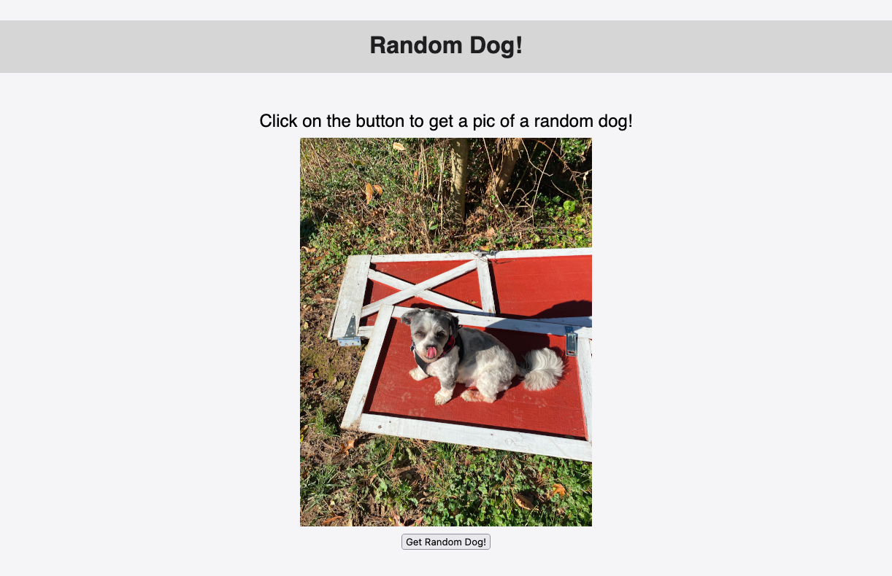

# Random Dog!

## Description

- A fun little app that brings joy by displaying a random dog pic at button click.
- This is an exercise in using AJAX and XMLHttpRequest instead of fetch

## Usage

- Load the site.

- Click the button.

- Smile.

  

## Credits

- My dog Toby is the first dog loaded on the page.
- The random dogs are sourced from the dog.ceo api
  for more info goto: https://dog.ceo/dog-api

## Github Link

https://github.com/legit-jb/random-dog

## Deployed Link

https://legit-jb.github.io/random-dog
